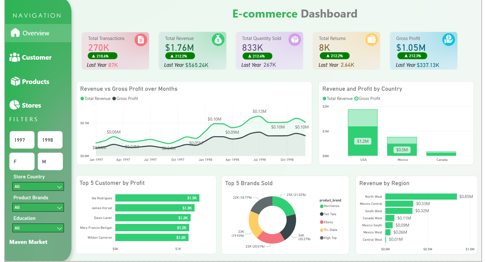
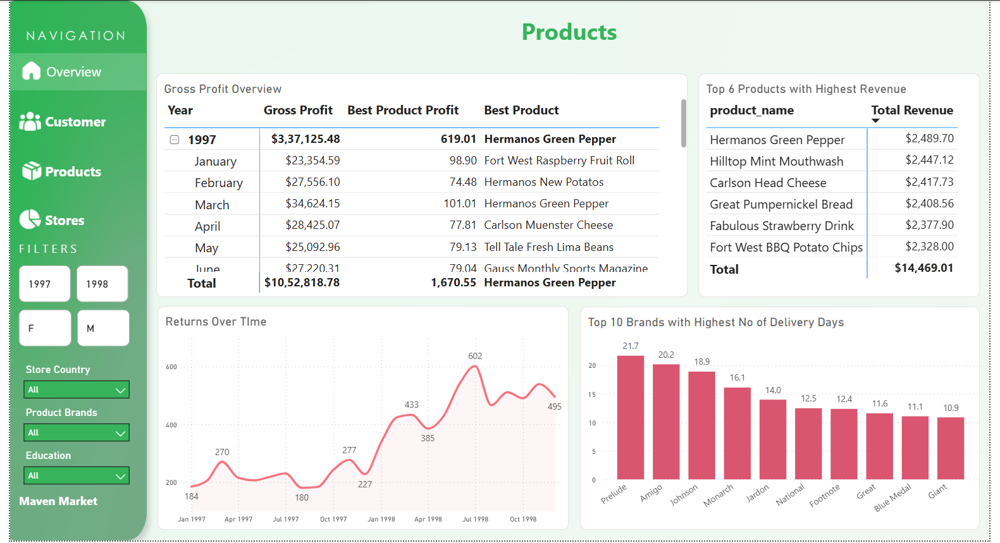
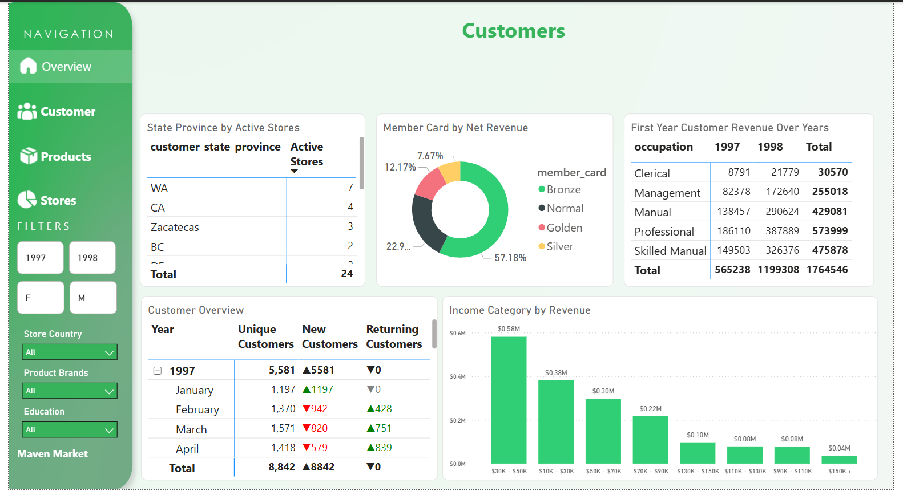
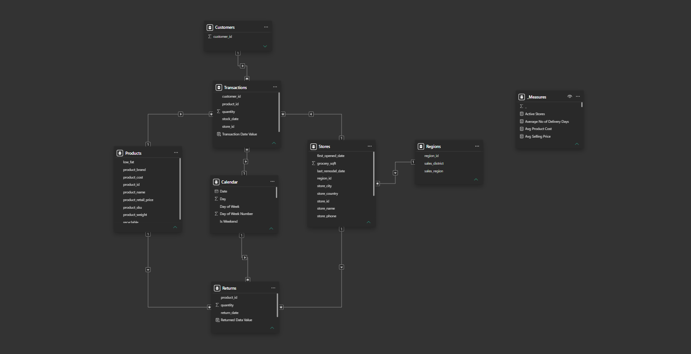

# 🛒 E-Commerce Analysis Dashboard
### End-to-End Retail Analytics with Power BI


---

## 📌 Project Overview

A production-grade **retail sales intelligence dashboard** built on the Maven Market dataset — a fictional multi-national grocery chain operating across the US, Canada, and Mexico. This project demonstrates a complete analytics workflow from raw CSV ingestion through to boardroom-ready visuals, covering data transformation, data modelling, advanced DAX, and report design.

> **Designed to answer:** *Where are we growing? Where are we losing money? Which customers, products, and stores drive the most value — and how does that compare to last year?*

---

## 🖼️ Dashboard Preview

| Overview | Product Performance |
|---|---|
|  |  |

| Customer Intelligence | Store & Region View |
|---|---|
|  |  |

---

## 📂 Data Model(Star Schema)



| Table | Type | Rows (approx) | Key Columns |
|---|---|---|---|
| **Transactions** | Fact | — | `transaction_date`, `product_id`, `customer_id`, `store_id`, `quantity`, `stock_date` |
| **Returns** | Fact | — | `return_date`, `product_id`, `store_id`, `quantity` |
| **Customers** | Dimension | — | `customer_id`, `full_name`, `gender`, `occupation`, `marital_status`, `yearly_income`, `member_card` |
| **Products** | Dimension | — | `product_id`, `product_name`, `product_brand`, `product_retail_price`, `product_cost`, `recyclable`, `low_fat` |
| **Stores** | Dimension | — | `store_id`, `store_name`, `store_type`, `store_city`, `store_state`, `store_country`, `total_sqft` |
| **Regions** | Dimension | — | `region_id`, `sales_district`, `sales_region` |
| **Calendar** | Date | — | `date`, `year`, `month name`, `quarter`, `week number`, `day of week`, `is weekend`, `start of month/quarter/year` |

**Relationships:** All dimensions connect to fact tables via single-direction one-to-many joins on shared ID keys. The Calendar table connects to both Transactions (`Transaction Date Value`) and Returns (`Returned Date Value`) via calculated date columns, enabling full time intelligence across both fact tables.

---

## 🔄 Data Loading & Transformation

### Source
Raw flat CSV files representing 6 tables of a retail operation.

### Power Query Steps

| Table | Key Transformations Applied |
|---|---|
| **Transactions** | Promoted headers · Changed column types · Added calculated column `Transaction Date Value = DATEVALUE(transaction_date)` for Calendar relationship |
| **Returns** | Promoted headers · Changed types · Added `Returned Date Value = DATEVALUE(return_date)` |
| **Customers** | Promoted headers · Merged `first_name` + `last_name` → `Full Name` calculated column · Cleaned postal code type |
| **Products** | Promoted headers · Verified `product_retail_price` and `product_cost` as decimal · Flagged `recyclable` and `low_fat` boolean flags |
| **Stores** | Promoted headers · Verified `total_sqft` and `grocery_sqft` as whole numbers · Parsed `first_opened_date` / `last_remodel_date` |
| **Regions** | Promoted headers · Verified `region_id` key integrity against Stores |

### Calendar Table
Built entirely in DAX using `CALENDARAUTO()` extended with 15 calculated columns:

```dax
Calendar =
ADDCOLUMNS(
    CALENDARAUTO(),
    "Year",            YEAR([Date]),
    "Month Number",    MONTH([Date]),
    "Month Name",      FORMAT([Date], "MMMM"),
    "Month Short",     FORMAT([Date], "MMM"),
    "Quarter",         "Q" & QUARTER([Date]),
    "Quarter Number",  QUARTER([Date]),
    "Week Number",     WEEKNUM([Date]),
    "Day",             DAY([Date]),
    "Day of Week",     FORMAT([Date], "DDDD"),
    "Day of Week Number", WEEKDAY([Date], 2),
    "Is Weekend",      WEEKDAY([Date], 2) >= 6,
    "Year Month",      FORMAT([Date], "YYYY MMM"),
    "Year Month Number", YEAR([Date]) * 100 + MONTH([Date]),
    "Year Quarter",    FORMAT([Date], "YYYY") & " Q" & QUARTER([Date]),
    "Start of Month",  DATE(YEAR([Date]), MONTH([Date]), 1),
    "Start of Quarter",DATE(YEAR([Date]), (QUARTER([Date])-1)*3+1, 1),
    "Start of Year",   DATE(YEAR([Date]), 1, 1)
)
```

---

## 📐 Data Modelling

- **Schema:** Classic **star schema** — two fact tables (Transactions, Returns) surrounded by four conformed dimensions
- **Relationships:** All active, single-direction, many-to-one from fact → dimension
- **Date Table:** Custom DAX Calendar bridging both fact tables with separate calculated date key columns to avoid ambiguous relationships
- **Measures Table:** Dedicated `_Measures` table with **60 DAX measures** organised into display folders by category

---

## 📊 Key DAX Measures

The model contains **60 measures** across 7 folders. Below are the most impactful ones worth highlighting.

---

### 💰 Total Revenue & Gross Profit
The foundation of the entire dashboard — revenue is calculated row-by-row using `SUMX` to correctly multiply quantity by the related product price across the Transactions table.

```dax
Total Revenue =
SUMX(Transactions, VALUE(Transactions[quantity]) * RELATED(Products[product_retail_price]))

Gross Profit = [Total Revenue] - [Total Cost]

Profit Margin % = DIVIDE([Gross Profit], [Total Revenue])
```

> Why it matters: using `SUMX` + `RELATED` instead of a simple `SUM` ensures accuracy even when filters slice across multiple products with different prices.

---

### 📅 Revenue YoY % — with Dynamic Arrow Formatting
One of the most visually impactful measures — returns a formatted text string with an up/down arrow so KPI cards update dynamically without any conditional formatting rules in the visual.

```dax
Revenue YoY % =
VAR CY = [Total Revenue]
VAR PY = [Revenue PY]
VAR _perc = DIVIDE(CY - PY, PY)
VAR _format = FORMAT(_perc, "0.0%;0.0%")
RETURN
    IF(_perc > 0, UNICHAR(9650) & " " & _format,
                  UNICHAR(9660) & " " & _format)
```

> `UNICHAR(9650)` = ▲, `UNICHAR(9660)` = ▼. The same pattern is reused for Profit YoY %, Transactions YoY %, and Returns YoY %.

---

### 👥 New Customers — Cohort Logic
Identifies customers making their very first purchase within the selected period by comparing the current customer set against all customers who transacted before the period start — using `EXCEPT` for set subtraction.

```dax
New Customers =
VAR MinDate = MIN('Calendar'[Date])
VAR CurrentCustomers = VALUES(Transactions[customer_id])
VAR AlreadyExisting =
    CALCULATETABLE(
        VALUES(Transactions[customer_id]),
        ALL('Calendar'),
        Transactions[Transaction Date Value] < MinDate
    )
RETURN COUNTROWS(EXCEPT(CurrentCustomers, AlreadyExisting))
```

> This is a true cohort measure — as you move the date slicer, it correctly recalculates who is "new" in that window.

---

### 🔄 Return Rate % — Cross-Fact Table
Connects two separate fact tables (Transactions and Returns) through the shared Calendar and Products dimensions to produce a meaningful operational metric.

```dax
Return Rate % = DIVIDE([Total Returns], [Total Quantity Sold])

Revenue Lost to Returns =
SUMX(Returns, VALUE(Returns[quantity]) * RELATED(Products[product_retail_price]))
```

> Surfacing `Revenue Lost to Returns` alongside `Return Rate %` shifts the conversation from volume to financial impact.

---

### 📈 Revenue YTD & Rolling 12M Average
Two complementary time views — YTD shows cumulative performance within the year, while the 12M rolling average smooths out seasonality to reveal the true underlying trend.

```dax
Revenue YTD =
VAR MaxDate = DATEVALUE(MAX(Calendar[date]))
VAR YearStart = DATE(YEAR(MaxDate), 1, 1)
RETURN CALCULATE([Total Revenue],
    FILTER(ALL(Calendar[date]), DATEVALUE(Calendar[date]) >= YearStart
                             && DATEVALUE(Calendar[date]) <= MaxDate))

Revenue 12M Rolling Avg =
VAR MaxDate = DATEVALUE(MAX(Calendar[date]))
VAR StartDate = EDATE(MaxDate, -12) + 1
RETURN CALCULATE([Total Revenue],
    FILTER(ALL(Calendar[date]), DATEVALUE(Calendar[date]) >= StartDate
                             && DATEVALUE(Calendar[date]) <= MaxDate))
```

---

### 🎨 Conditional Formatting Measures (CF Helpers)
Rather than hard-coding colours in visuals, dedicated measures return `"Green"` / `"Red"` / `"Grey"` strings that drive dynamic font and icon colour on every KPI card — making the dashboard automatically react to performance without manual threshold management.

```dax
CF Revenue =
VAR _perc = DIVIDE([Total Revenue] - [Revenue PY], [Revenue PY])
RETURN SWITCH(TRUE(), _perc > 0, "Green", _perc < 0, "Red", "Grey")
```

> The same pattern powers CF Profit, CF Transactions, CF Returns, CF New Customers, and CF Returning Customers.

---

## 📈 KPIs & Business Questions Answered

| Business Question | KPI / Visual |
|---|---|
| How much did we sell and earn? | Total Revenue · Gross Profit · Profit Margin % |
| Are we growing vs last year? | Revenue YoY % · Profit YoY % · Transactions YoY % (with ▲▼ arrows) |
| Which products make the most money? | Best Product · Top Brand Revenue · Product Profit ranking |
| Where are returns hurting us? | Return Rate % · Revenue Lost to Returns · Returns YoY % |
| Who are our best customers? | Revenue per Customer · New vs Returning Customers · First-year cohort revenue |
| Which stores and regions lead? | Revenue per Store · Revenue Share % · Top Region Revenue |
| What's the seasonal pattern? | Q4 Revenue Share · Peak vs Low Month · Weekend vs Weekday revenue |
| How are we trending? | 3M / 6M / 12M Rolling Average · Revenue Running Total |
| How fast is delivery? | Average No of Delivery Days |

---

## 🧰 Tools & Technologies

| Tool | Purpose |
|---|---|
| **Power BI Desktop** | End-to-end report development |
| **Power Query (M)** | Data ingestion, cleaning, transformation |
| **DAX** | 60 measures across sales, returns, customers, time intelligence, stores |
| **Star Schema** | Data modelling design |
| **Maven Market Dataset** | Source data (6 CSV files) |

---

## 🗂️ Repository Structure

```
maven-market-dashboard/
│
├── 📊 MavenMarketDashboard.pbix       ← Main Power BI file
│
├── 📁 data/
│   ├── MavenMarket_Transactions.csv
│   ├── MavenMarket_Customers.csv
│   ├── MavenMarket_Products.csv
│   ├── MavenMarket_Stores.csv
│   ├── MavenMarket_Regions.csv
│   └── MavenMarket_Returns.csv
│
├── 📁 screenshots/
│   ├── dashboard_exec_summary.png
│   ├── dashboard_products.png
│   ├── dashboard_customers.png
│   ├── dashboard_stores.png
│   └── data_model.png
│
└── README.md
```

---

## 🚀 How to Run

1. Clone this repository
2. Open `MavenMarketDashboard.pbix` in **Power BI Desktop** (free download from Microsoft)
3. If prompted, point the data source to the `/data` folder
4. Refresh the data — all transformations and measures load automatically

---

## 💡 Key Learning Outcomes

- Built a **custom DAX Calendar table** with 15+ time intelligence columns from scratch
- Implemented **60 production DAX measures** covering MTD/QTD/YTD, MoM/QoQ/YoY, rolling averages, cohort analysis, and dynamic conditional formatting
- Designed a clean **star schema** linking two fact tables to four conformed dimensions
- Used **TOPN, MAXX, FIRSTNONBLANK, EXCEPT** and other advanced DAX patterns for product/customer intelligence
- Applied **dynamic arrow formatting** (`▲ / ▼`) on KPI cards using text-returning measures
- Created **CF helper measures** to drive icon and colour formatting without hard-coding thresholds

---

## 👤 Author

**[Mohammed Ehsan]**
[LinkedIn](https://www.linkedin.com/in/mohammed-ehsan-a90875251/) · [GitHub]([https://github.](https://github.com/Ehzaan))

---

*Built with the Maven Market dataset. This is a portfolio project for demonstration purposes.*
